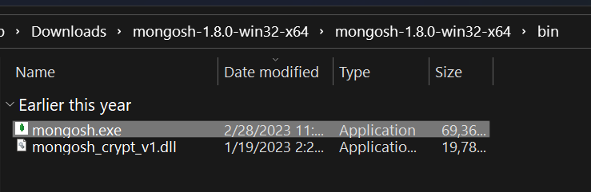
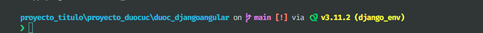
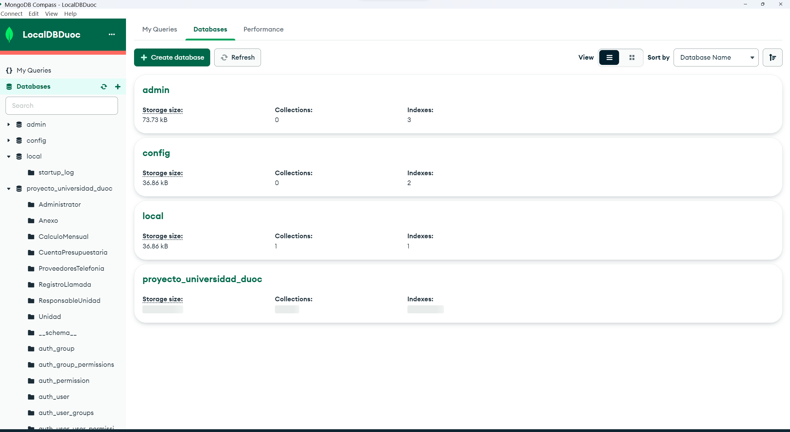

# Instrucciones de despliegue de aplicación.

# Creación de usuario admin para MongoDB

Requisitos:

Haber seguido guía de instalación de MongoDB Community Server https://www.mongodb.com/try/download/community y tenerlo correctamente instalado.
> Si se trabaja desde Windows:
> Descargar MongoShell desde: [Mongo Shell](chrome-extension://jaekigmcljkkalnicnjoafgfjoefkpeg/suspended.html#ttl=MongoDB%20Shell%20Download%20%7C%20MongoDB&pos=1000&uri=https://www.mongodb.com/try/download/shell)

> Descomprimir y dirigirse a directorio bin

> Ejecutar mongosh.exe



Escribir los siguientes comandos:

```
use admin

```

```
db.createUser(
  {
    user: "myAdmin",
    pwd: "myAdminPassword",
    roles: [ { role: "root", db: "admin" } ]
  }
)
```

Comprobar creación de usuario con:

```
db.getUser("myAdmin")
```

# Instalación y configuración de BackEnd

Pre-requisitos:

Tener creado usuario Admin a través de Mongo Shell y haber instalado MongoDB Compass

Tener instalado Pip, Python, NodeJS

Instrucciones de levantamiento de ambientes de desarrollo:

> Todos los comandos son a ejecutar en la línea de comandos cmd.

> con la terminal de comandos en el directorio root del proyecto

Instalar ambiente virtual

```
pip install virtualenv
```

Crear ambiente virtual, utilizamos "django_env" en este ejemplo, cambiar nombre de env en caso de usar otro.

```
virtualenv django_env
```

Activar ambiente virtual --este comando deberá re-ejecutarse cada vez que se quiera lanzar django, todas las instalaciones subsiguientes se realizaran con el env activado

```
django_env\Scripts\activate
```

Una vez activado, la terminal debería verse de tal manera (nombre_env)path\to\project\proyecto_duocuc>, siendo "path\to\project" la ruta de su computador hacia el proyecto clonado.

> Imagen de ejemplo:



Instalación requerimientos del proyecto

```
pip install -r requirements.txt
```

#Realizar creación de modelos, poblado y migración de BD:

Dirigirse a la carpeta duoc_djangoanular

```
python manage.py makemigrations
python manage.py migrate
```

Luego de ver el output con los mensajes de OK, dirigirse a MongoDB compass para comprobar la correcta creación de la base de datos y sus datos predefinidos:



# Instalación de dependencias FrontEnd

Luego de instalar los requerimientos de django instalar Angular

```
npm install -g @angular/cli
```

Dirigirse a carpeta de duoc_angularfrontend

```
npm install
```
